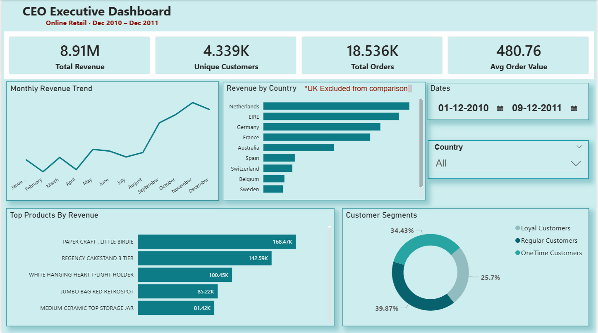

# 📊 Online Retail — CEO Executive Dashboard
### Built with Power BI | MySQL | Power Query | DAX



> An interactive business intelligence dashboard analyzing **541,000+ rows** of real UK e-commerce transaction data, built to give executives a clear, filterable view of revenue, customers, products and market performance.

---

## 📁 Project Overview

This project analyzes the **UCI Online Retail Dataset** (Dec 2010 – Dec 2011) and transforms raw transactional data into an executive-ready Power BI dashboard.

| Metric | Value |
|--------|-------|
| 📦 Total Records | 541,909 rows |
| 💰 Total Revenue | £8.91M |
| 👥 Unique Customers | 4,372 |
| 🧾 Total Orders | 18,536 |
| 🌍 Countries | 38 |
| 📅 Date Range | Dec 2010 – Dec 2011 |

---

## 🗂️ Project Structure

```
online-retail-dashboard/
│
├── 📄 Online_Retail.xlsx          # Raw dataset
├── 📄 online_retail.sql           # MySQL exploration queries
├── 📄 Online_retail_dashboard.pbix  # Power BI dashboard file
├── 🖼️ dashboard_screenshot.png    # Dashboard preview image
└── 📄 README.md                   # This file
```

---

## ✨ Dashboard Features

### 🏢 CEO Executive Dashboard
- 💰 **Total Revenue** KPI card — formatted in millions
- 👥 **Unique Customers** KPI card
- 🧾 **Total Orders** KPI card
- 📈 **Avg Order Value** KPI card
- 📉 **Monthly Revenue Trend** — line chart (Jan → Dec)
- 🌍 **Revenue by Country** — horizontal bar chart (UK excluded for scale)
- 🛍️ **Top Products by Revenue** — bar chart (postage/non-products filtered out)
- 🍩 **Customer Segments** — donut chart (Loyal / Regular / One-time)
- 🗓️ **Date Range Slicer** — interactive Between date picker
- 🌐 **Country Slicer** — dropdown filter

---

## 🛠️ Tools & Technologies

| Tool | Purpose |
|------|---------|
|  | Dashboard & visualization |
|  | Data exploration & querying |
| **Power Query** | Data cleaning & transformation |
| **DAX** | Custom measures & calculations |
| **Excel** | Raw data source |

---

## 🚀 How to Run This Project

Follow these steps to reproduce the dashboard on your own machine.

---

### ✅ Prerequisites

Before you start, make sure you have:

- [ ] [Power BI Desktop](https://powerbi.microsoft.com/desktop/) installed (free)
- [ ] [MySQL Community Server](https://dev.mysql.com/downloads/mysql/) installed (optional — for SQL exploration)
- [ ] The dataset file `Online_Retail.xlsx` downloaded

---

### 📥 Step 1 — Download the Dataset

1. Go to the [UCI Machine Learning Repository](https://archive.ics.uci.edu/ml/datasets/online+retail)
2. Download the **Online Retail.xlsx** file
3. Save it to a folder on your computer, e.g. `C:/Projects/OnlineRetail/`

> 💡 Alternatively, the dataset is also available on [Kaggle — Online Retail Dataset](https://www.kaggle.com/datasets/vijayuv/onlineretail)

---

### 🗄️ Step 2 — (Optional) Run SQL Queries in MySQL

If you want to explore the data in MySQL first:

1. Open **MySQL Workbench**
2. Open the file `online_retail.sql` from this repo
3. Run the script — it will:
   - Create the database `online_retail_db`
   - Create the `retail` table
   - Clean the date column
   - Run exploratory queries (revenue, top products, country breakdown, Pareto analysis)

```sql
-- Quick start — run these in order
CREATE DATABASE online_retail_db;
USE online_retail_db;
-- Then run the full online_retail.sql script
```

> 💡 MySQL is optional for this project. You can skip straight to Power BI if you prefer.

---

### 📊 Step 3 — Open Power BI and Load the Data

1. Open **Power BI Desktop**
2. Click **Home → Get Data → Excel Workbook**
3. Navigate to your `Online_Retail.xlsx` file
4. Select the sheet and click **Transform Data** to open Power Query

---

### 🧹 Step 4 — Clean the Data in Power Query

Apply these steps one by one in Power Query Editor:

**4a. Remove rows with missing CustomerID**
- Click the `CustomerID` column header
- Home → Remove Rows → **Remove Blank Rows**

**4b. Filter out negative quantities (returns)**
- Click the `Quantity` column dropdown arrow
- Number Filters → **Greater Than** → type `0`

**4c. Filter out zero-price rows**
- Click the `UnitPrice` column dropdown arrow
- Number Filters → **Greater Than** → type `0`

**4d. Fix the date column type**
- Click the `InvoiceDate` column
- Data Type → select **Date/Time**

**4e. Add a Revenue column**
- Add Column → **Custom Column**
- Name: `Revenue`
- Formula: `= [Quantity] * [UnitPrice]`

**4f. Close & Apply**
- Click **Home → Close & Apply**

---

### 📐 Step 5 — Create DAX Measures

Go to **Home → New Measure** and create these one by one. Just copy and paste each formula:

```dax
-- 1. Average Order Value (per invoice, not per row)
Avg Order Value = 
DIVIDE(SUM(retail[Revenue]), DISTINCTCOUNT(retail[InvoiceNo]))
```

```dax
-- 2. Loyal Customers (5 or more orders)
Loyal Customers = 
CALCULATE(
    DISTINCTCOUNT(retail[CustomerID]),
    FILTER(
        VALUES(retail[CustomerID]),
        CALCULATE(DISTINCTCOUNT(retail[InvoiceNo])) >= 5
    )
)
```

```dax
-- 3. Regular Customers (2 to 4 orders)
Regular Customers = 
CALCULATE(
    DISTINCTCOUNT(retail[CustomerID]),
    FILTER(
        VALUES(retail[CustomerID]),
        CALCULATE(DISTINCTCOUNT(retail[InvoiceNo])) >= 2 &&
        CALCULATE(DISTINCTCOUNT(retail[InvoiceNo])) < 5
    )
)
```

```dax
-- 4. One-Time Customers (exactly 1 order)
OneTime Customers = 
CALCULATE(
    DISTINCTCOUNT(retail[CustomerID]),
    FILTER(
        VALUES(retail[CustomerID]),
        CALCULATE(DISTINCTCOUNT(retail[InvoiceNo])) = 1
    )
)
```

---

### 🎨 Step 6 — Build the Dashboard Visuals

Build these visuals in order on Page 1:

| # | Visual Type | Fields |
|---|------------|--------|
| 1 | Card | `Revenue` → Sum → rename **Total Revenue** |
| 2 | Card | `CustomerID` → Count Distinct → rename **Unique Customers** |
| 3 | Card | `InvoiceNo` → Count Distinct → rename **Total Orders** |
| 4 | Card | `Avg Order Value` measure → rename **Avg Order Value** |
| 5 | Line Chart | X: `InvoiceDate` (Month), Y: `Revenue` |
| 6 | Bar Chart | Y: `Country`, X: `Revenue` — add Top N filter, exclude UK |
| 7 | Bar Chart | Y: `Description`, X: `Revenue` — Top N = 8, filter out POSTAGE |
| 8 | Donut Chart | Values: `Loyal Customers`, `Regular Customers`, `OneTime Customers` |
| 9 | Slicer | `InvoiceDate` → Style: **Between** |
| 10 | Slicer | `Country` → Style: **Dropdown** |

---

### 🖌️ Step 7 — Format the Dashboard

1. **Add a title** — Insert → Text Box → type `CEO Executive Dashboard` (size 20)
2. **Add subtitle** — Insert → Text Box → type `Online Retail · Dec 2010 – Dec 2011` (size 12, red colour)
3. **Set background colour** on all cards → Format → Background → light teal `#D6EEF0`
4. **Rename Page 1** → double click the tab → type `CEO Dashboard`
5. **Format Revenue card** → Callout value → Display units → **Millions**

---

### 💾 Step 8 — Save Your Work

1. **File → Save As** → name it `Online_retail_dashboard.pbix`
2. To publish online: **File → Publish → Publish to Power BI Service** (requires free Microsoft account)

---

## 📸 Dashboard Preview

| Section | What it shows |
|---------|--------------|
| 🔢 KPI Cards | Top-line revenue, customers, orders and avg order value at a glance |
| 📉 Monthly Trend | Clear revenue growth from mid-2011 with November peak |
| 🌍 Country Chart | Netherlands and EIRE lead internationally after UK excluded |
| 🛍️ Top Products | Paper Craft Little Birdie leads at £168K revenue |
| 🍩 Customer Segments | 39.87% regular, 34.43% one-time, 25.7% loyal |

---

## 💡 Key Insights from the Data

- 📅 **November 2011** was the single best month — nearly **2× average monthly revenue** (seasonal Christmas demand)
- 🇬🇧 **United Kingdom** accounts for the vast majority of sales — international expansion opportunity exists
- 🔁 **74.3% of customers** placed more than one order — strong repeat purchase behaviour
- 📦 **Top 5 products** account for a disproportionate share of revenue — key SKUs to protect stock of
- 🚫 **No sales on Saturdays** — the store/platform appears to be closed on weekends

---

## 🗺️ Roadmap

- [x] CEO Executive Dashboard
- [ ] Sales Manager Dashboard (coming soon)
- [ ] Finance & Accounting Dashboard
- [ ] Operations & Warehouse Dashboard

---

## 🙋 About

Built by a Power BI learner working through real-world data. This is a portfolio project using publicly available retail transaction data.

If you found this helpful, feel free to ⭐ star the repo!

---

## 📜 License

This project uses the [UCI Online Retail Dataset](https://archive.ics.uci.edu/ml/datasets/online+retail) which is publicly available for research and educational use.

---

*Made with 💙 using Power BI Desktop*
